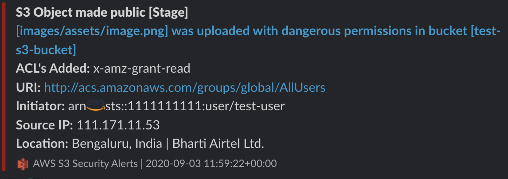
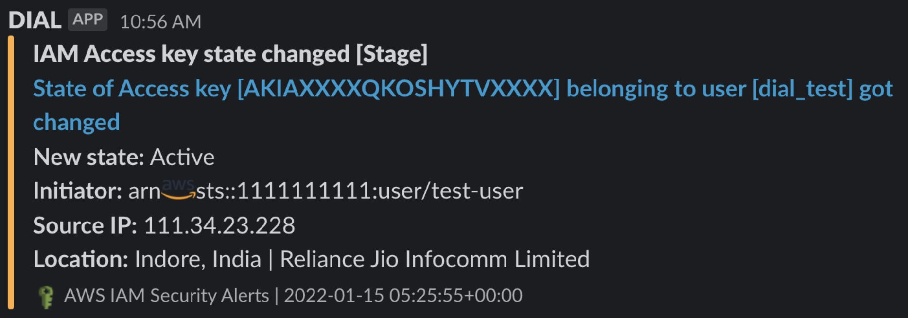
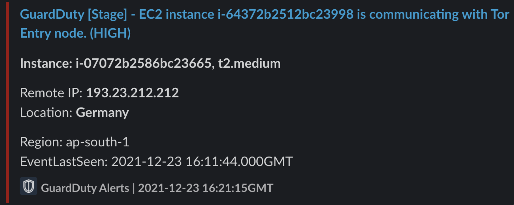

# DIAL
---

Workloads on cloud provide equal opportunities for hackers as much as they do for internal teams. Cloud-native companies are open to attacks from both outside forces and from within. With ever growing risk of a security breach and cloud misconfiguration being one of the most common factor of the same, the mean time to detect is supposed to be reduced to seconds instead of minutes/hours/days. Hence, we introduce our inhouse tool DIAL(Did I Alert Lambda?) which helps us to monitor any number of AWS accounts at any given period of time.

## What is DIAL?
---
**DIAL(Did I Alert Lambda?)** is a centralised security misconfiguration detection framework which completely runs on AWS Managed services like AWS API Gateway, AWS Event Bridge & AWS Lambda. Few of the key features of DIAL includes.

- It's an event driven framework, because of which maximum detection time for any misconfigurations is < 7 seconds. **MTTD(Mean Time to Detect) < 4 secs**.
- It will only be triggered when event of interest are generated.
- Highly scalable and Cost efficient as it is built on top of AWS lambda and it gets triggered when events of interest are seen.
- Modular architecture; Which means you can easily add more event handlers and usecases according to your needs.

To read more about the same, you can go through the following technical [blog](https://blog.cred.club/team-cred/tech/averting-cloud-misconfiguration-at-scale-with-dial/), 

You will be getting actionable alerts as shown below with all the relevant details:

## Architecture
---

The architecture is broken down into two different components:

- Parent Controller
- Child Controller

**Child Controller;** The child controller acts as an event handler, which needs to be deployed in all accounts/regions you want the detection framework, which is connected to Event Bridge as a trigger which in turn triggers Child controller when any event of interest happens. This controller is also responsible for sending out alerts to the user configured SLACK channel along with the severity that is defined under the config file. It then forwards the whole response object to the Parent controller for further processing and storage.

**Parent Controller;** DIAL’s framework just needs one Parent Controller which acts as an aggregator for your SIEM, IR and persistent storage of alerts. Parent Controller works along with API Gateway which is connected with one AWS Lambda at the backend, whose sole purpose is to collect data. The request to API gateway is supposed to be Authenticated which is again configurable according to end user’s needs. 

**Note: Here we have used TheHive project as an open source IR tool to ingest data, you can simply change the function on the Parent controller to send the response object to any SIEM/IR tool of your choice, just make sure to change the necessary parameters that needs to be added on top of it.**

## Services covered:
---
- EC2
- S3
- IAM
- Security Group
- GuardDuty
- VPC
- RDS
- DynamoDB
- Secret Manager
- Parameter Store(System Manager)

## UseCases covered
---
We are currently releasing the detection module of DIAL, which will help you to detect any misconfigurations, we do plan to release the remediation module in near future. The following are the edge cases that DIAL is currently capable of detecting.

- IAM
    - Any priv escalations via “CreatePolicy/AttachPolicy/CreatePolicyVersion”
    - Inactive access Keys made public
    - Admin policy attached to any user/role
    - Console Sign In by any-user
    - MFA deleted/removed

- S3
    - S3 bucket made public
    - S3 object made public
    - S3 bucket policy misconfigured
    - Misconfigured ACL for bucket/object

- EC2
    - VPC Peering connection to unknown account
    - Laxed Security groups(0.0.0.0/0 access on ports)
    - Associating private subnet with public route table
    - Un realistic instance type creation(p4d.24xlarge etc)

- Secret Manager/SSM Parameter Store
    - Critical secret parameters called by which user
    - Any deletion of secret parameters

- Database(RDS/DynamoDB)
    - Snapshot creation of available DBs
    - Modification of DB to make them public
    - Creating DB with public access True

- GuardDuty
    - Guard duty findings

## Installation and Deployment
---

Please refer the following [file](cfn/DEPLOY.md)
